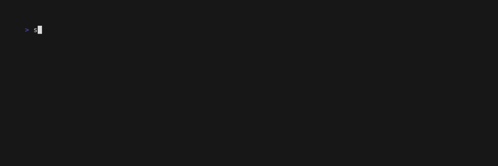

[](https://github.com/aleury/spacehog/actions/workflows/ci.yml)
[](https://github.com/aleury/spacehog/actions/workflows/nightly.yml)
[](https://github.com/aleury/spacehog/actions/workflows/audit.yml)

# Install with Cargo

```
$ cargo install spacehog
```

# Usage

From any directory, run:

```sh
spacehog
```



## Examples

```sh
# View the top 5 largest files under the current directory
$ spacehog

# View the top 10 largest files under the current directory
$ spacehog -n 10

# View the top 10 largest files under the given path
$ spacehog ./stuff -n 10
```
